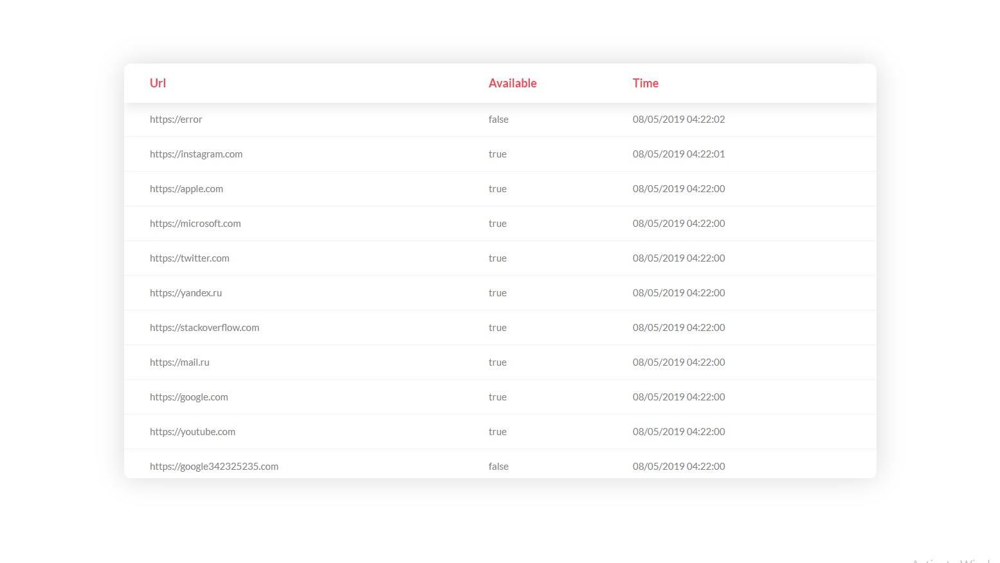

# HttpServersAvailability
Checks servers availability

1. Create database in PostgreSQL
2. Run servers.sql against the created database
3. Update settings.yaml with connection string in folders ServerStat and StatBrowser
4. Build and run main.go in folders ServerStat and StatBrowser
